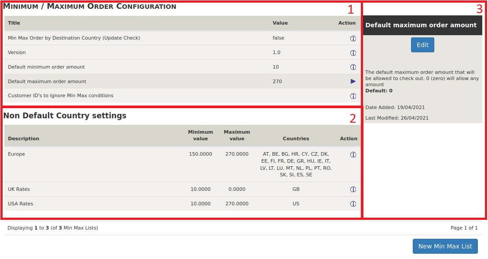
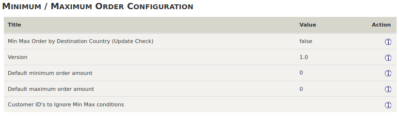
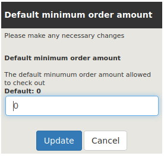
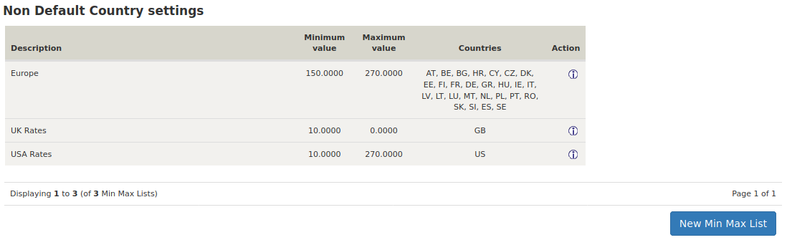
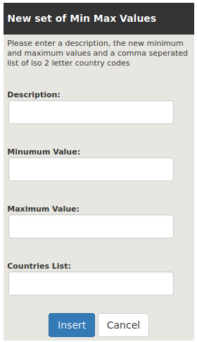
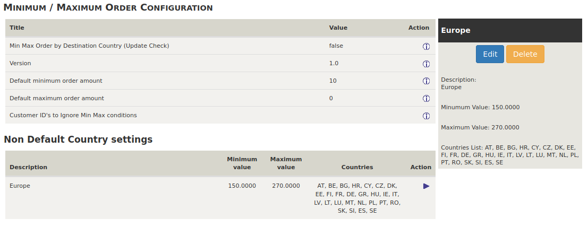
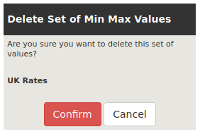

---
title: "Edit Minimum Maximum Order By Country"
date: 2021-04-27T12:53:58+01:00
draft: false
---

## Change minimum and maximum values
- Go to Admin > LOCATION / TAXES > Min Max Order Settings 

The screen is split into three section.

 

1. The top part contains the default values 
1. The lower part the specific country values 
1. The side box allows for entry of new values and changes to existing ones.

## Modifying the default settings

- The default settings are:
    - Min Max Order by Destination Country (Update Check): true or false .  
    This checks for new versions of the Min Max Order plug-in (will not work until after version 1.0)
    - Version : 1.0 The version of Min Max Order installed.
    - Default minimum order amount : The default value of the minimum order amount that you will allow to checkout. Default 0 - any amount allowed.  
    **Note:** This is in the stores local currency (in the, UK GBP, US USD)
    - Default maximum order amount: The default value of the maximum order amount that you will allow to checkout. Default 0 - any amount allowed.  
    **Note** This is in the stores local currency (in the, UK GBP, US USD)
    - Customer ID's to Ignore Min Max conditions : A comma separated list of the customer ID's that will not be bound by the minimum/maximum order amounts. Default '' - (empty) all customers bound by rules.  
    You can use this if you want to set up exceptions to allow you to process orders for customers that are out side the usual limits.
- To modify any of the values in this section
    - Click on the action icon for the value you want to change
    - Click the Edit button in the side box. The side box will change to display the existing value and allow you to make changes.  
      
    - Make the required change.
    - Click on the Update button to save.
    - Click the Cancel button to return without saving the values.
    
## Country specific settings
If you require specific settings for a country or a list of countries these are displayed in the bottom section of the screen under 'Non Default Country settings'. Initially there will be no entries in this section. 

- To create your entry you will need:
    - A name for the group of rates
    - the minimum value (may be the same as the default).
    - The maximum Value (may be the same as the default).
    - A list of the ISO 2 letter country codes that will use the new minimum and maximum values

### Insert a new entry

- Click on the New Min Max List button at the bottom of the screen.  
The input area will be displayed in the side box.  

- Complete the fields in the side box
    - Description: A description of the set of min max values
    - Minimum Value: The minimum order amount that you will allow to checkout for the countries listed in Countries List: below.  
    **Note:** This is in the stores local currency not the country's currency.
    - Maximum Value: The maximum order amount that you will allow to checkout for the countries listed in Countries List: below.  
    **Note:** This is in the stores local currency not the country's currency.
    - Countries List: A comma separated list of the countries to which the minimum and maximum values above apply. e.g. GB,US,FR for Great Britain, United States of America and France (GB, US, FR is also acceptable)  
        **Note:** Do not include the same country in multiple rates as the results will be unreliable. If necessary create a separate set of rates for that country alone.
    
- Click the Insert button to save the rates.
- Click the Cancel button to return with out saving the values.  
    
### Edit an existing set of rates  

- Click on the action icon of the rates required.  
  
- Click on the Edit button in the side box.
- Make the required change(s).
- Click on the Update button to save.
- Click the Cancel button to return without saving the values.

### Delete an existing set of rates

- Click on the action icon of the rates required.
- Click on the Delete button in the side box.
- The side box will refresh and ask you to confirm your choice.

- Click on the Confirm button to delete the entry.
- Click the Cancel button to return without deleting the entry.
