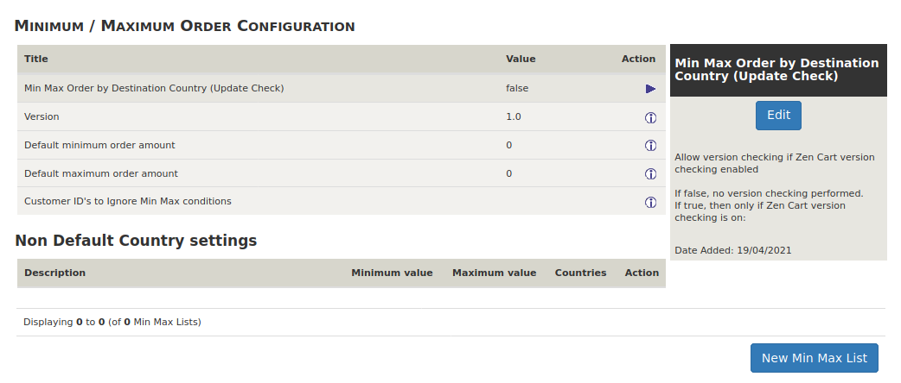

# Installing Minimum Maximum Order By Country

## Installation

- To install min_max_order copy the files from admin to YOURADMIN and includes to the includes directory on your server.
- Log in to zen cart admin on your server.
    You should get two messages:  
    - `Enabled Min Max Order by Destination Country Configuration Menu. Under Locations / Taxes menu. `  
    - `Installed Min Max Order by Destination Country v1.0.`  
    
The default setting will not effect orders in any way.

- Go to Admin > LOCATION / TAXES > Min Max Order Settings.

The screen should look like this  

to change these setting see [Edit Minimum Maximum Order By Country](Edit.md)
